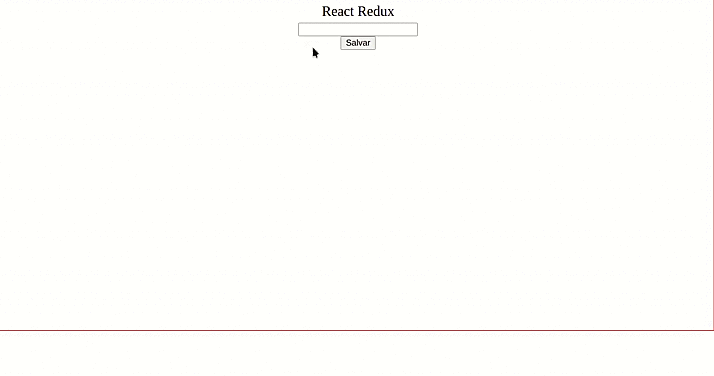

# Guia de como utilizar o React no Redux

Abaixo o ciclo que seguiremos para implementar o redux na nossa aplicação:
<a name="ciclo"></a>


[link](https://itnext.io/integrating-semantic-ui-modal-with-redux-4df36abb755c) da imagem.

Aqui vamos fazer uma implementação sobre como utilizar o redux no react. Basicamente teremos um input que ao digitar algo as informações serão guardadas no estado e recuperadas através de um botão que ao ser clicado mostra a informação na tela. 

# Sumário

- 1 - [Para começar vamos criar o react app](#criar)
- 2 - [Agora vamos instalar o redux](#instalar)
- 3 - [Dentro da pasta src crie uma outra pasta chamada "redux" e dentro de redux crie outras três pastas, "actions", "reducers" e "store"](#pastas)
- 4 - [O código da aplicação ficou assim](#app)
- 5 - [Seguindo o ciclo](#seguindo)
  - 5.1 - [Conforme o ciclo acima vamos começar pelas actions](#actions)
  - 5.2 - [Seguindo o fluxo, agora partimos para o reducer](#reducer)
  - [❗️Ponto de atenção❗️](#atenção)
    - 5.2.1 - [Combinando reducers](#combinando)
  - 5.3 - [Agora chegou a vez da store!](#store)
- 6 - [Fazer com que tudo convese](#conversar)
- 7 -[Agora vamos para a reta final...](#final)
-  8 - [Clone do portifólio](#clone)
#### 1 - Para começar vamos criar o react app <a name="criar"></a>
No terminal escolha um diretório onde esse app ficará, em seguida digite o código no terminal:

```sh
npx create-react-app nome-do-app
```

Entre na pasta do app:

```sh
cd nome-do-app
```
Para iniciar o projeto no browser:
```sh
npm start
```
Deverá "automágicamente" abrir uma aba no navegador e aparecer algo assim:

#### 2 - Agora vamos instalar o redux <a name="instalar"></a>

Para instalar a biblioteca redux digite o seguinte código no terminal:

```sh
npm install --save redux react-redux
```
"redux" é a biblioteca que possui a implementação do Redux.

"react-redux" é a biblioteca oficial para realizar a conexão entre React e Redux.

#### 3 - Dentro da pasta src crie uma outra pasta chamada "_redux_" e dentro de redux crie outras três pastas, "_actions_", "_reducers_" e "_store_" <a name="pastas"></a>

Vamos ter algo assim:


#### 4 - O código da aplicação ficou assim <a name="app"></a>
src/App.js
```javaScript
import { Component } from 'react'
import './App.css';

class App extends Component {

  render() {
    return (
      <section className="App-section">
        <header>
          <h1>React Redux</h1>
        </header>
        <label htmlFor="text-input">
          <input name="text" id="text-input" type="text" />
        </label>
        <button type="button">Salvar</button> 
      </section>
    );
  }
}

export default App;
```
Aqui nada acontece, agora vamos partir para a implementação do redux!! :rocket:


#### 5 - Seguindo o ciclo <a name="seguindo"></a>
[Qualquer dúvida, reveja o ciclo!](#ciclo)
##### 5.1 - Conforme o ciclo acima vamos começar pelas actions. <a name="actions"></a>
Lembra daquela pasta **redux** que criamos? Então, lá dentro temos uma pasta chamada **actions**, nesse caso vamos criar um arquivo chamado "*inputActions.js*", lá vamos ter o seguinte código:

*src/redux/actions/inputActions.js*
```javaScript
const INPUT_CHANGE = 'INPUT_CHANGE';

const inputAction = (text) => ({
  type: INPUT_CHANGE,
  text,
});

export default inputAction;
```
* Em uma constante declaramos a action;
* Depois criamos uma função que retorna um objeto com o tipo (type) da action e o que essa action irá receber, no caso o texto (text) do input; <a name="lembra"></a>
* Por fim exportamos essa função;

E pronto! A nossa action está feita. :pushpin: 

##### 5.2 - Seguindo o fluxo, agora partimos para o reducer <a name="reducer"></a>

Dentro da pasta **redux**, agora vamos utilizar a pasta **reducers**. Lá vamos criar um arquivo chamado *inputReducer.js* com o seguinte código: 

*src/redux/reducers/inputReducer.js*
```javaScript
const INPUT_CHANGE = 'INPUT_CHANGE';

const INITIAL_STATE = {
  text: '',
}

const inputreducer = (state = INITIAL_STATE, action) => {
  switch (action.type) {
    case INPUT_CHANGE:
      return {
        ...state,
        text: action.text,
      };
    default:
     return state;
  }
}

export default inputreducer;
```
* Novamente em uma constante declaramos a mesma action do arquivo anterior.
* Criamos um estado inicial, onde esse estado sempre é um objeto, ele pode receber string (como é o nosso caso), mas também pode recebem array, objeto, boleano.
* Depois temos uma função a qual verifica qual foi o tipo da ação efetuada, e ela atualiza o estado conforme descrevemos.
* Por fim exportamos a função.

##### :exclamation:Ponto de atenção:exclamation: <a name="atenção"></a>
O state é imutável. Portanto, devemos usar métodos que façam clonagem e não mutação do estado.
Você pode se aprofundar um pouco mais [aqui](https://medium.com/aurum-tech/controlando-o-estado-de-aplica%C3%A7%C3%B5es-react-com-redux-e-optics-fa524d96488c).

###### 5.2.1 - Combinando reducers <a name="combinando"></a>
Depois de criar os reducers é hora de unificar todos eles através do "*combineReducers*".
Aqui podemos criar um arquivo "*index.js*".

*src/redux/reducers/index.js*
```javaScript
import { combineReducers } from 'redux';
import inputreducer from './inputReducer'

const rootreducer = combineReducers({
  inputreducer,
});

export default rootreducer;
```
* Aqui vamos importar o "*combineReducers*" da biblioteca "*redux*";
* Importamos os reducers que criamos;
* Atribuímos "*combineReducers*" a uma variável e ela recebe como parâmetro um objeto onde podemos colocar todos os reducers;
* Por fim, exportamos o "*rootreducer*";

Concluímos o reducer. :clap:

OBS: se houvesse mais reducers o código ficaria assim:
```javaScript
import { combineReducers } from 'redux';
import inputreducer from './inputReducer'
import exempleReducer from './exempleReducer'

const rootreducer = combineReducers({
  inputreducer,
  exempleReducer,
});

export default rootreducer;
```
##### 5.3 - Agora chegou a vez da store! <a name="store"></a>

Agora o último mas não o menos importante, o **store**!

Dentro da pasta store, vamos criar um arquivo *index.js* com o código:

*src/redux/store/index.js*
```javaScript
import {createStore } from 'redux';
import rootreducer from '../reducers';


const store = createStore(
  rootReducer,
   window.__REDUX_DEVTOOLS_EXTENSION__ && window.__REDUX_DEVTOOLS_EXTENSION__()
  );

export default store;
```
* Primeiro importamos da biblioteca do redux a *createStore*;
* Depois atribuimos essa função em uma variável chamada **store** (pode ser outro nome, mas por boa prática usamos store),
* A função pode receber até dois parâmetros, a *rootReducer* onde estão concentrados todos os nossos stors e nesse caso o segundo parâmetro é para o funcionamento de uma extensão chamada [Redux DevTools](https://chrome.google.com/webstore/detail/redux-devtools/lmhkpmbekcpmknklioeibfkpmmfibljd?hl=pt-BR) disponível para o chorme.

Um pouco de como ela funciona: :blush:


E terminamoooos!!! :boom:

ops! inda não, mas falta pouco! :eyes:

#### 6 - Fazer com que tudo converse. <a name="conversar"></a>

Agora precisamos fazer com que o react converse com o redux, e para isso vamos precisar fazer algumas alterações no nosso *index.js* que é responsável por renderizar toda a nossa aplicação.

*src/index.js*
```javaScript
import React from 'react';
import ReactDOM from 'react-dom';
import { Provider } from 'react-redux';
import store from './redux/store';
import App from './App';

ReactDOM.render(
  <Provider store={ store }>
    <App />
  </Provider>,
  document.getElementById('root')
);
```
* Precisamos importar o *Provider*, da biblioteca "react redux" e a nossa *store* do diretório onde ela se encontra;
* Basicamente o *Provider* que vai "prover" as informações do store;

Aqui é somente isso!:pushpin:

#### 7 - Agora vamos para a reta final... <a name="final"></a>

Agora vamos ver tudo funcionando, no *App.js*:

```javaScript
import { Component } from 'react'
import { connect } from 'react-redux';
import inputAction from './redux/actions/inputActions'
import './App.css';

class App extends Component {
  constructor(props) {
    super(props)
    this.state = {
      shouldAppear: false
    }
    this.handleChange = this.handleChange.bind(this);
    this.clickChange = this.clickChange.bind(this);
  }

  handleChange({ target }) {
    const { inputChange } = this.props;
    const {name, value } = target;
    if(name === 'text') {
      inputChange(value);
      this.setState({
        shouldAppear: false,
      });
    }
  }

  clickChange() {
    this.setState({
      shouldAppear: true,
    });
  }

  render() {
    const { shouldAppear } = this.state;
    const { inputState} = this.props;
    return (
      <section className="App-section">
        <header>
          <h1>React Redux</h1>
        </header>
        <label htmlFor="text-input">
          <input onChange={this.handleChange} name="text" id="text-input" type="text" />
        </label>
        <button onClick={() => this.clickChange()} type="button">Salvar</button> 
        {shouldAppear && <p>{inputState}</p>} 
      </section>
    );
  }
}

//Pegaremos as funções das actions
const mapDispatchToProps = (dispatch) => ({
  inputChange: (text) => dispatch(inputAction(text)),
});

//Pegamos o estado nos reducers
const mapStateToProps = (state) => ({
  inputState: state.inputreducer.text,
})

export default connect(mapStateToProps, mapDispatchToProps)(App);
```

* Primeiro passo importar o **connect**
* Importaremos também **inputAction** das actions, é a função que recebe como parâmetro o texto do input, lembra? [Você pode rever aqui](#lembra)
* Depois lá na ultima linha do código é onde "conectamos" tudo, o **connect** recebe dois parâmetros **mapStateToProps** que pega os estados no reducer. E o **mapDispatchToProps** que despacha o que as funções (no caso a função que importamos da action) recebem no parâmetro para a action.
* Criamos uma lógica para que a função receba o texto do input:
```javaScript
  handleChange({ target }) {
    const { inputChange } = this.props;
    const {name, value } = target;
    if(name === 'text') {
      inputChange(value);
      this.setState({
        shouldAppear: false,
      });
    }
  }
```
essa lógica conversa com o input:
```javaScript
  <label htmlFor="text-input">
          <input onChange={this.handleChange} name="text" id="text-input" type="text" />
        </label>
```

* Tem outra lógica que faz com que o texto apareça ao clicarmos no botão, envolvendo apenas lógica que se aplica ao react.

Aqui a aplicação finalizada:


E agora acabamos de verdade!!!:heart_eyes:

:rocket::rocket::rocket::rocket::rocket::rocket::rocket::rocket::rocket::rocket::rocket::rocket::rocket::rocket::rocket::rocket::rocket::rocket::rocket::rocket::rocket::rocket::rocket::rocket:

#### 8 - Clone do portfólio. <a name="clone"></a>

Caso você faça o clone do portfólio, após clonar, no terminal entre na pasta do projeto e instale as dependências necessárias digitando:

```sh
npm install
```
Para abrir o projeto no browser:

```sh
npm start
```

 Sei que foi algo bem simples, mas foi mesmo para tentar passar o conceito básico do redux, espero que eu tenha conseguido ajudar de alguma forma.:smile:
